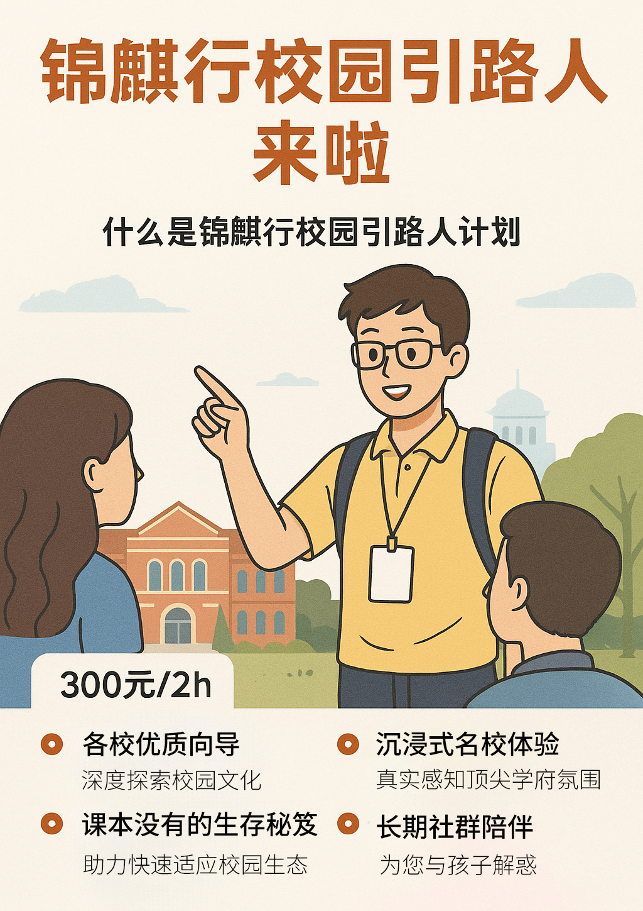

# 锦麒行·校园引路人计划

---

### 一、项目介绍  

“锦麒行·校园引路人计划”是一项轻商业化的校园深度体验项目。我们通过“校友向导”这一角色，为各年龄段的学生及家长提供专业、个性化的校园导览服务，帮助您从学术备考、选课规划到校园生活的方方面面，全面了解名校文化与学习氛围。  

### 二、服务亮点  

1. **严选优质向导**  
   - 向导均为保研学霸、竞赛获奖者或社团骨干  
   - 选拔面试淘汰率高达 66.7%，确保专业素养与服务质量  

2. **实战备考与选课攻略**  
   - 独家整理高效备考方案、选课指南与社交资源库  
   - 包括时间管理、竞赛项目选择等实用技巧  
   - 由在校学子结合亲身经历，手把手传授  

3. **沉浸式校园体验**  
   - 深度参访名校核心场景（图书馆、实验室、学生活动中心等）  
   - 根据孩子兴趣定制 1v1 专属路线  
   - 真实感受顶尖学府的学术氛围与校园文化  

4. **长期社群陪伴**  
   - 完成导览后，可加入“锦麒行陪伴社群”  
   - 社群内可不限时提问（体验限 2 次），或预约 15 分钟语音答疑  
   - 用朋辈视角，为孩子的成长与升学规划答疑解惑  

### 三、支持院校  

- **武汉地区**  
  - 华中科技大学  
  - 武汉大学  
  - 中南财经政法大学  
  - 中国地质大学  

- **成都地区**  
  - 西南财经大学  

（更多院校持续拓展中）

### 四、价格与预约  

- **费用**：300 元／2 小时  
- **预约方式**：  
  1. 私信官方微信客服
  2. 在锦麒行微信小程序预约  

立即加入“锦麒行·校园引路人计划”，开启专属名校深度之旅！  

---

**联系我们**  

- 客服邮箱：<harry@jinqitrip.com>  
- 咨询电话：17871788835
